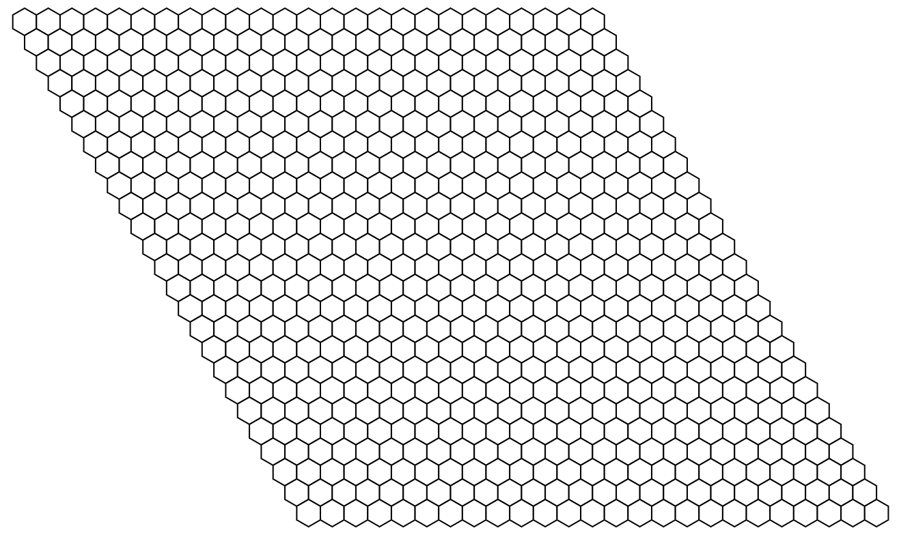
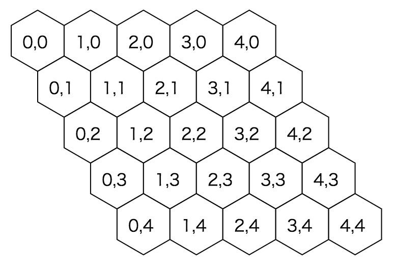

# react-hex [](https://travis-ci.org/airtoxin/react-hex)

draw svg hexagonal grid with react

## Install

`$ npm i react-hex`

## Usage

```js
import React from 'react';
import { PointyToppedHex, gridPoints } from '../src/index.jsx';

export default () => {
  const type = 'pointy-topped';
  const size = 30;
  const oX = 100;
  const oY = 100;
  const width = 10;
  const height = 10;

  const Hexes = gridPoints(type, size, oX, oY, width, height).map(([x, y]) =>
    <PointyToppedHex key={`${x}-${y}`} x={x} y={y} fill="white" stroke="black" />);

  return (
    <svg width="1000" height="1000">
      {Hexes}
    </svg>
  );
};
```



see `dev` directory

## Documents

First, [Hexagonal Grids](http://www.redblobgames.com/grids/hexagons/) article helps you to understand grid system.

All functions were named exported so you can use `import { NAME } from 'react-hex';`

### `<PointyToppedHex x={} y={} size={}/>`

React component of a pointy topped hexagon. Those props used for hexagon location.

| name | type   | description         | required | default |
|------|--------|---------------------|----------|---------|
| x    | number | center coordinate x | yes      | -       |
| y    | number | center coordinate y | yes      | -       |
| size | number | edge size           | yes      | -       |

The other props are passed to underlay svg polygon element.

### `<FlatToppedHex x={} y={} size={}/>`

React component of a flat topped hexagon. Those props used for hexagon location.

| name | type   | description         | required | default |
|------|--------|---------------------|----------|---------|
| x    | number | center coordinate x | yes      | -       |
| y    | number | center coordinate y | yes      | -       |
| size | number | edge size           | yes      | -       |

The other props are passed to underlay svg polygon element.

### `gridPoint(type, size, gridX, gridY, oX=0, oY=0)`

__return: `[x, y]`__

Helper function to calculate hexagon location in grid.

| name  | type        | description                                         | required | default |
|-------|-------------|-----------------------------------------------------|----------|---------|
| type  | enum string | hexagon type (`'pointy-topped'` or `'flat-topped'`) | yes      | -       |
| size  | number      | hexagon size                                        | yes      | -       |
| gridX | number      | coordinate x in hexagonal grid system               | yes      | -       |
| gridY | number      | coordinate y in hexagonal grid system               | yes      | -       |
| oX    | number      | origin x in pixel grid system                       | no       | 0       |
| oY    | number      | origin y in pixel grid system                       | no       | 0       |

### `gridPoints(type, size, oX, oY, gridWidth, gridHeight)`

__return: `[[x0, y0, gridX0, gridY0], [x1, y1 gridX1, gridY1] ...]`__

Helper function to bulk calculate hexagon location in grid.

| name      | type        | description                                         | required | default |
|-----------|-------------|-----------------------------------------------------|----------|---------|
| type      | enum string | hexagon type (`'pointy-topped'` or `'flat-topped'`) | yes      | -       |
| size      | number      | hexagon size                                        | yes      | -       |
| oX        | number      | origin x in pixel grid system                       | yes      | -       |
| oY        | number      | origin y in pixel grid system                       | yes      | -       |
| gridWidth | integer     | grid width                                          | yes      | -       |
| gridHeigh | integer     | grid height                                         | yes      | -       |

__pointy topped grid coordinate x,y__



__flat topped grid coordinate x,y__


## License

MIT
